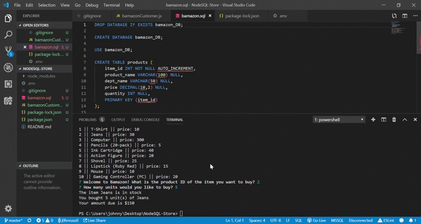

# NodeSQL-Store

The Bamazon Online Store!

Mock Amazon-like CLI App, powered with Node and MySQL

Installed packages include mysql and inquirer

When you start up the app by entering "node bamzonCustomer", you see a list of items for sale. If something strikes your fancy, just enter the number to the left of the item you want in the CLI, then enter how many you want to buy. If there's enough of the product in stock, your purchase will go through and you'll be prompted a bill! If the item is out of stock, you will go back to the main shopping menu

You will need your own mySQLWorkbench with a root password and server port to use the app yourself

To Be Added: Functionality that allows users to restock the database 

### Demo for Bamazon CLI App

